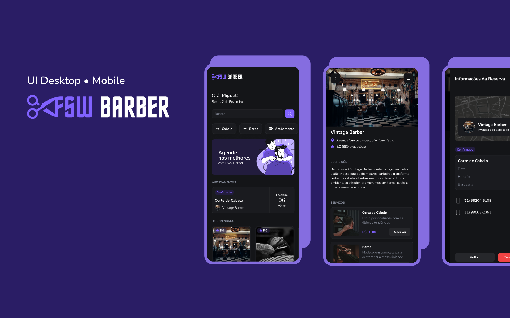

<p align="center">
  <a href="#-tecnologias">Tecnologias</a>&nbsp;&nbsp;&nbsp;|&nbsp;&nbsp;&nbsp;
  <a href="#-projeto">Projeto</a>&nbsp;&nbsp;&nbsp;|&nbsp;&nbsp;&nbsp;
  <a href="#-layout">Layout</a>&nbsp;&nbsp;&nbsp;|&nbsp;&nbsp;&nbsp;
  <a href="#memo-licença">Licença</a>
  <a href="#-instalacao">Instalação</a>
</p>

<p align="center">
 

  
</p>

<br>

<p align="center">
  
</p>

## 🚀 Tecnologias

Esse projeto foi desenvolvido com as seguintes tecnologias:

- [NextJS]()
- [React.js]() 
- [PostgreSQL]()
- [TailwindCSS]()  
- [Prisma]() 
- [TypeScript]()
- [Javascript](https://scrollrevealjs.org/)
- [ShadcnUI](https://ui.shadcn.com/)

## 💻 Projeto

DoctorCare é uma página institucional no formato One Page, responsiva, para usar em diversos tipos de micros, pequenas e médias empresas. Contém as seguintes seções: Header, Navigation, Home, Sobre, Serviços e Footer

## 🔖 Layout

Você pode visualizar o layout do projeto através [desse link](https://www.figma.com/design/ByDjVh7THsTnsSVRKNN8yy/FSW-5.0-%5BLive%5D?node-id=0-1&t=Br7byKZROhWp4wZn-0). É necessário ter conta no [Figma](https://figma.com) para acessá-lo.


## Getting Started


# TASKS 

- [x] Setup do banco
- [x] Seeding do banco (colocar dados)
- [x] Introdução ao Next.js
- [x] Tailwind e ShadcnUI
- [x] Git Hooks


## 🔖 Instalação

Clone o projeto:

```bash
git clone run dev

```

Instale as dependencias do projeto:

```bash
npm run dev
# or
yarn dev
# or
pnpm dev
# or
bun dev
```
```


